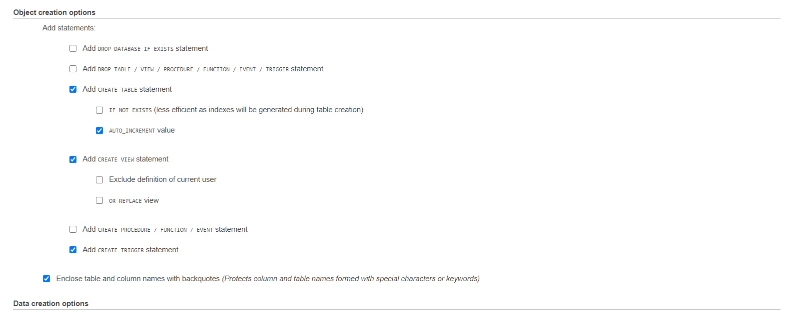
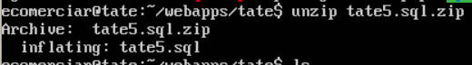

---

title: 'Migrating a Wordpress Site - Backupguard is useless'
date: '2020-09-24'
sinopsis: "So you have a big site, over 30gb in size? Well, there is no easy solution for migration, really there isnt. Doing it the hardway is less frustrating than trying a couple of easy ways."
tags: [Wordpress, backups, migrations]

---

# So you have to migrate a site?

There are a couple of plugins, which, most of them offer paid solutions, to migrate your site.
This could be fine if your site is relatively small, and does not have a HUGE sql DB.    
  
I was given the task of migrating a site, actually duplicating it to a server, in order to test a couple of new plugin combinations.   
The site is big, 3000 variable products, so over 27,000 lines of csv. Plus a couple more plugins which have huge TABLES, and the SQL weight was almost 1GB.   
  
## What I tried and made me fail and waste time.

1. ManageWP
    First I used managewp, https://managewp.com/
    If you forget about the fact that they need your credentials in order to start a backup of your site, well, it seems like a nice service. But, in order to have control you have to pay, starting at $2. Luckily for me, the first backup which is free failed. It asked me for the $2 to try and do another backup, but I mailed support. They were kind and they told me my site had over 1.000.000 files and that their system would'nt work. So ManageWP, you are useless for big sites, sorry. Kind customer service though, props to them.   
      

2. BackupGuard. Gosh.
    So they initial worked. I was able to make a full backup with their .sgbp system files. 30GB was the final size. I downloaded the file via SFTP since downloading through the browser did not work, and of course, you should'nt trust the browser for filesizes that big. Once Done I uploaded the file to my new server. I downloaded the Backupguard plugin into my new server, and guess what? To migrate you need to pay $25 for the plugin to be "intelligent" and be able to merge your tables correctly. And guess what else? I payed it and it didn't work.   
    Errors ranging from: Php_execution_time was to little, I even bumped it up to 3000, the server running out of space, which is insane, failing with no error message. Even the logs were empty. Finally I got fed up. The plugin gives you the option of just restoring the DB. This never worked. It would always timeout. Huge waste of time (donwloading and uploading 30gb files.) And also their SGBP extractor is useless and asks for a passphrase to unlock their files when they never even give you the option of adding one while creating the backup.    

3. Updraft. Did not even try it, since you need to pay the full plugin in order to migrate I believe.

# So how to do it...

Requirements:

* SSH acesss to the VPS
* SFTP access to the Server
* Some bash experience is needed.

### The DB:

1. Install wp-PHPmyAdmin on the original wordpress site.
2. Check your DB name on the new server. You can check this in your wp_config.php file.
3. If the name of the DB in the new server is the same as in the old one, this is fine, if not well do an extra step.
4. Go to wp-PHPmyAdmin into the export tab.
5. Click export Custom, this settings worked for me. If they do not work for you, add the DROP Tables option

6. Click on go, it will start downloading in your browser once its finished processing.
7. Once you have it in your computer. Zip it. You'll greatly reduce the size.
8. Upload via FTP to your wordpress main directory.
9. Now, connect via ssh to your server.
10. Navigate to the directory where you uploaded your zip file.
11. Unzip your sql dump by using the `unzip` command, like so:
   
  
 
12. Once that is done, do the following command: `wp db import yoursqldump.sql`.
13. If it went fine it will give you a success msg. 

### The files

There are many ways. 

1. Easiest but most time consuming would be to just download all the files via FTP, just download the root folder, and then upload them replacing when its needed.
2. Hardest but faster time would be zipping everything via ssh, with zip command. Downloading it, then uploading to the new server and unziping respectively.

## Conclusion

Do not pay for backup plugins, they do not work if you have a big site. I'ts better to pay a professional that has experience migrating sites if you do not want to do it yourself

