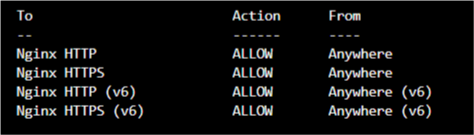
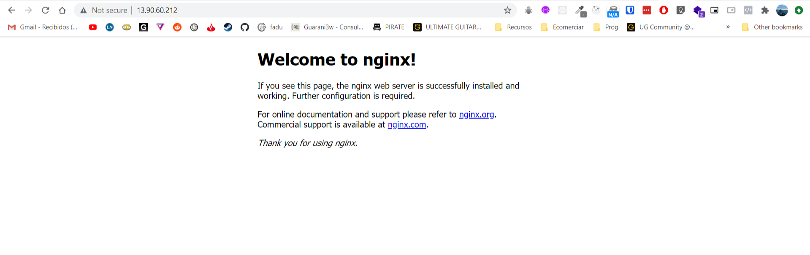
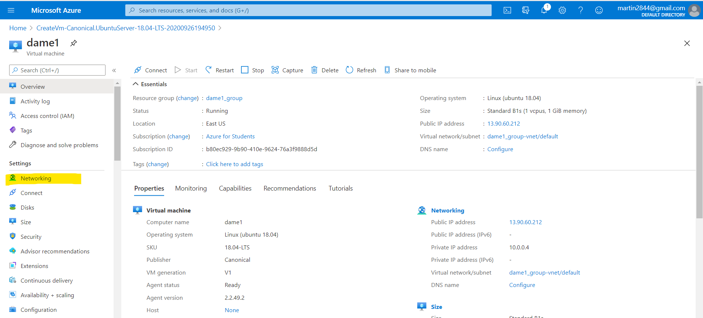
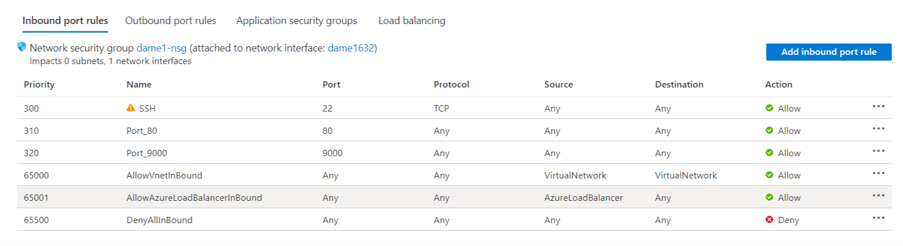
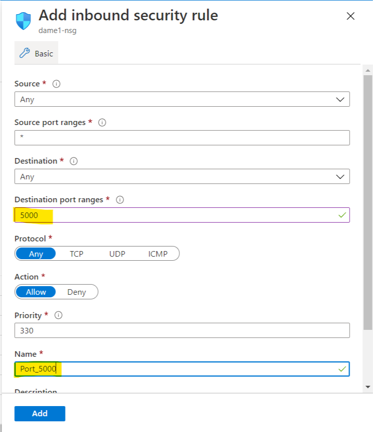
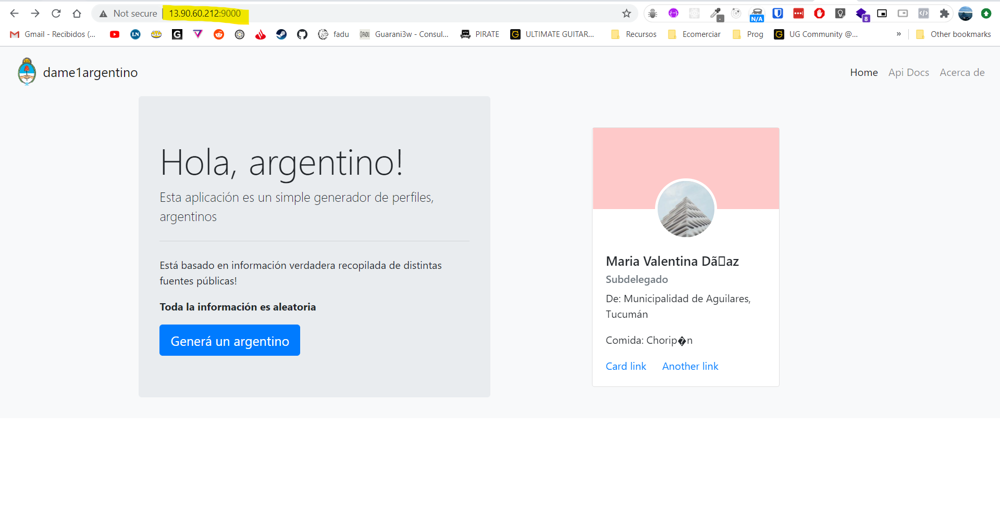

---


title: 'Deploy nodeJS app to Azure VPS'
date: '2020-09-27'
sinopsis: 'Step by Step deploying a nodejs app to azure.'
tags: [deploy, nodejs, azure]


---

# Table of contents
1. [Installing Node](#introduction)
2. [Installing and setting up NGINX](#nginx)
3. [Downloading our app and setting it up](#setupapp)
4. [Setting the reverse proxy](#proxy)

## Installing Node <a name="introduction"></a>

1. Create a new VPS in AZURE, once that is done, on a terminal emulator running bash. Take note of the VPS's public IP
2. SSH into the VPS with the following command: `ssh yourUser@yourPublicIP` 
3. It will prompt for your password, which you would have set up when creating the VPS
4. Once logged in, install NODE. We are running a UBUNTU 18.04 Server.
Run the following commands, first:  
`curl -sL https://deb.nodesource.com/setup_12.x | sudo -E bash -` 
then:  
`sudo apt-get install -y nodejs`

This will install node on your vps

5. According to this guide https://www.digitalocean.com/community/tutorials/how-to-set-up-a-node-js-application-for-production-on-ubuntu-18-04, on digital ocean, you'll need to install Build Essential package for some npm modules to work.
`sudo apt install build-essential`

## Installing NGINX <a name="nginx"></a>

1. Update, and install nginx 

```
sudo apt update
sudo apt install nginx
```

2. Enable NGINX
```
sudo ufw allow 'NGINX HTTP'
sudo ufw allow 'NGINX HTTPS'
sudo ufw enable
```

Check it with: `sudo ufw status` should see something similar to this:  
   

Check your status to see if the server is running:

`systemctl status nginx`   

It should show as active. You can also, and should navigate to your VPS IP address and see the default NGINX Page.
   

## Downloading the app to our vps and setting it up <a name="setupapp"></a>
My application, is up on github. This is very common, so we can just clone it into NGINX html folder.   

Navigate there on your vps:  `cd /var/www/html`   
And clone your repo, in my case:  `sudo git clone https://github.com/martin2844/argentine-person-generator`     

Now cd into your directory, in my case `cd argentine-person-generator`    
And install all the modules, by `sudo npm install`  

Now, my node application is built on express. And it runs on port 9000. Usually we are told to run it on port 5000. 
To test if our app is ok, we are going to add a port rule setting to Azure, in order to let people access our port 5000, or 9000 on my case.

Go to Azure networking:     
 
Click on add inbound PORT rule:     
 
Add the needed rule:  
    

Now, for good measure, back on our SSH terminal we are going to:   
`sudo nginx -s reload`

Then, still on our app's directory, run it via `node app.js` or whatever your main file name is and now, on our servers IP adress and our port, we should see our app running:     


## Setting the reverse proxy for NGINX <a name="proxy"></a>
Now, we need to do, whats called a reverse proxy, because, we want to access our application at the base URL not at some port.

I followed this guide, but with the following changes @ config file:
https://www.scaleway.com/en/docs/how-to-configure-nginx-reverse-proxy/

Basically, once you have nginx installed you will unlink the default config:  
  
`unlink /etc/nginx/sites-enabled/default`   
  
And you're going to create a new one:  

```
cd /etc/nginx/sites-available
sudo nano reverse-proxy.conf
```
And you're going to paste the following config, changing the yourIP with your VPS's Ip, and the PORT with your Express's Port.   


```
server {
        listen 80;
        listen [::]:80;

        access_log /var/log/nginx/reverse-access.log;
        error_log /var/log/nginx/reverse-error.log;

        location / {
                    proxy_pass http://yourIP:yourPORT/;
  }
}
```   

Cntrl X to quit, and yes to save.   

"Copy the configuration from /etc/nginx/sites-available to /etc/nginx/sites-enabled. It is recommended to use a symbolic link."   


`ln -s /etc/nginx/sites-available/reverse-proxy.conf /etc/nginx/sites-enabled/reverse-proxy.conf`   

With the following command, you can check if you've any mistake on your config file.   

`nginx -t`   
  
Should return this:
```
nginx: the configuration file /etc/nginx/nginx.conf syntax is ok
nginx: configuration file /etc/nginx/nginx.conf test is successful
```

Now, for good measure your going to stop and start your NGINX server:

`sudo systemctl stop nginx`   
and   
`sudo systemctl start nginx`    
  
and after   
`sudo nginx -s reload`   

Now, go to your git repository's folder and start your app, node app.js   
You should be able to see your app running at your IP address from your browser.   
  
Now, what happens if you exit the SSH connection? The process will be stopped and the webapp wont be served.  
TO avoid this, you can use the following command.  
`nohup node app.js &`   
nohup will make it run after you quit the SSH connection, and the & char will run it on the backround allowing you to exit the ssh window.   

The following step, in the next post will be to add a custom domain to our app to resemble a normal app.   

Just a quick note, its recommend to install a service such as PM2 to manage our app. Nohup is just the fastest way to make it run.

