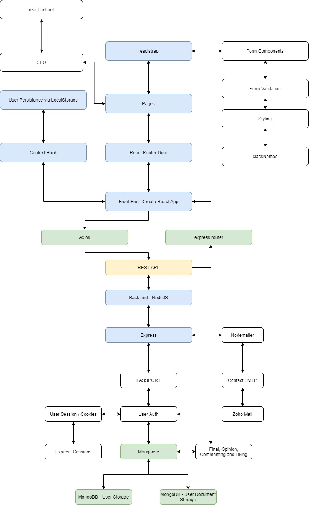

---

title: 'Faduense, My first FullStack MERN app'
date: '2020-03-17'
sinopsis: "I dont feel really comfortable putting this specific project code as public, but I'll show you what I did"
tags: [React, MongoDB, NodeJs, AWS]

---

# Faduense, my first "real" fullstack app.

Faduense is a project I made to try and solve an issue I had while studying for my architecture degree.
Basically everyone was sharing their experience on final exams via facebook, and it was getting messy. There was no real way of searching for information, as there were no indexes, only a search bar that only god knows how it works.

So I set to make an app, using javascript which was what I knew at the moment, but of course trying to implement a new technology I was learning, React. I had dome some stuff, but never something this big.

I layed out a basic plan, I knew I needed a DB to store finals, a way of authenticating users, I knew I needed a back end as well as a front end, and both had to work together.

So I started, in between working full time as a site manager at a construction site, I learnt React, or at least tried to. 
Soon, I realized that maybe it was more than I could chew on. Things took me weeks at a time. I thought no one would register to my page unless I added google sign in. That only took me a week to implement, using nodeJS passport package, it was tough. I had tutorials, but none applied to my way of doing things in the specific way I needed them to. So I resorted to the documentation. Man, I learnt a lot.

Always use official documentation, It sometimes is more difficult to digest than say, a tutorial on youtube, but if you spend the time, more often then not I find that if the package is popular enough, and if it has good documentation, you'll understand more.

Anyways, the project grew big fast. I needed user auth, form validation, session persistance, global state. You name it. It was a lot of stuff. So I drew a diagram, you can check it out. And of course, any questions, feel free to contact me.

The diagram shows exactly what I used for the main features of the projects. Once It was sort of done (its never really finished). 
I had to deploy. I first used heroku, which, for small projects is great, but if you need a bit production ready stuff, it sucks.
Putting your ssl and domain forces you to use a paid dyno which costs $7 dollars per month, which is the same that the lowest tier AWS EC2 instance costs. Of course its a bit more complex to deploy to AWS, but its worth it. Its much more customizable to fit your needs, and performance is greater! (which means better SEO.)

