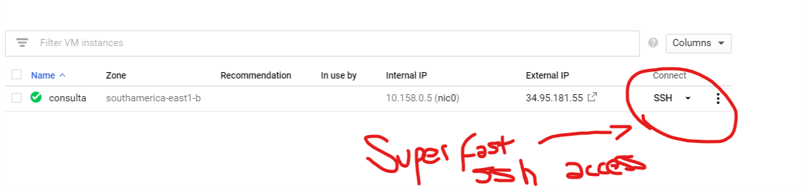
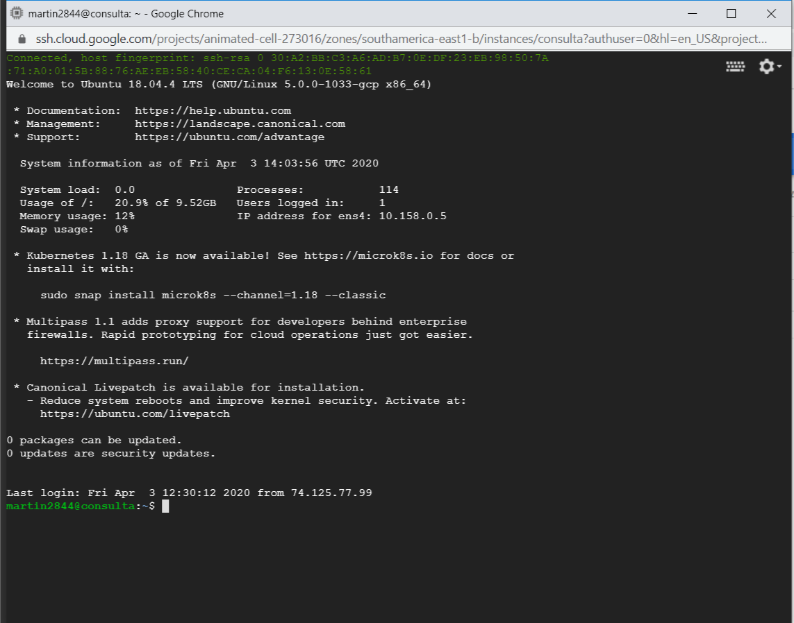
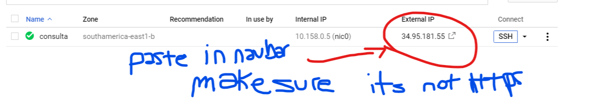
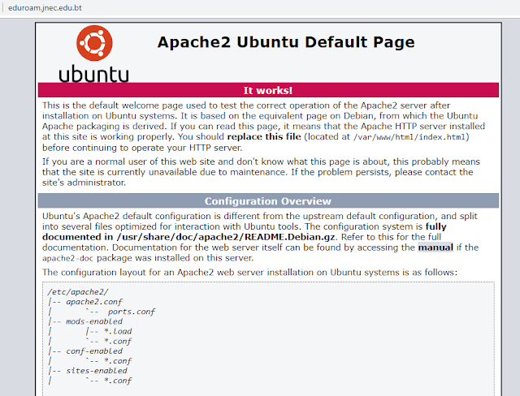

---


title: 'Wordpress Google Cloud'
date: '2020-04-02'
sinopsis: "Deploy a wordpress site with a VM on google cloud compute for free! check it out here"
tags: [wordpress, deploy, google, LAMP]

---

So, after reading for a bit, there arent any really good free hosting solutions for wordpress sites. Really, all of them have a tradeoff. Either no SSL, or no custom domain etc.

Well, there is an answer to this. Since there are free VM instances available, you can launch a wordpress site via an instance. You can use whichever you like. Both google and amazon provide free tier VM machines for a year. And they are both really good. 

Now, in both AWS and Google Compute you can launch a VM machine with a custom image allready set for wordpress, but its more expensive than a normal ubuntu image, and of course you wont be able to customize it as much.

So I'll guide you through setting your own wordpress site from the terminal of your VM, that is to say your SSH connection.

Now, I wont go into much detail about what does what, but if you follow it along it will go well. It helps knowing a bit of bash commands.

1. First make a google cloud account, they'll ask for your credit card and they'll charge you a dollar, but thats it. Its just to prevent spam.
2. Go to google compute and launch new instance - The size depends on various factors, but basically it will depend on the size of your website - traffic, amount of storage needed, processing power. etc.

Also allow HTTPS and HTTP traffic.

Once you decided on your instance size, I chose Micro, wait for your instance to finish creating itself. 

4. Press SSH, this I love about google cloud computing. Its not necessary to donwload your keys and putty if your on windows in order to ssh to the VM.
(Image of SSH button)

Once it finishes connecting it will be like so:


5. After that, let the fun begin! In order to make a wordpress site we need to set our VM with the correct packages.
   
First update and upgrade the VM

```bash
    sudo apt update -y
    sudo apt upgrade -y
```
Then we need to set up apache! or the famous LAMP

Linux, Apache, MySQL and PHP

6. Run the following commands 

```bash
    sudo apt install apache2

```
Once its done, apache2 should be running, you can check it by doing the following

```bash
    sudo systemctl status apache2
```

It should say, its active and running. 

if its not running do the following:
```bash
    sudo systemctl start apache2
```

You should be able to check it by copying the VM IP adress and pasting it to your browser's nav bar, it should show you the default LAMP page.
Make sure you are not forcing HTTPS on the IP adress. That is not yet set, so it wont work if you do that.
This is your IP adress:

This is the stock LAMP page:


In order to guarantee that the service will be always execute the following command:

```bash
    sudo systemctl enable apache2
```
If the VM is restarted, it should start apache2 right away.

7. Now we are going to install the DB. We are going with MARIADB this time.

```bash
    sudo apt install mariadb-server mariadb-client
```

We are installing both client and server, the mariadb-server is to setup our DB server, and the client we needed to be able to connect to it.

Now start the DB server

```bash
    sudo systemctl start mariadb
```

Again, check it with status

```bash
    sudo systemctl status mariadb
```

Should be up and running.

8. Now we are going to configure the DB

Go for the following command: 

```bash
    sudo mysql_secure_installation
```

Hit enter for the prompt that says enter current password for root, since we havent set any yet.

Type Y, for the Set root password prompt!

Set a password and remember it, its important.

And select Y for remove anonymous user, also Y for disallow root login remotely, and Y again for test DB removal, and privilege reload.

Reload mariadb now:

```bash
    sudo systemctl restart mariadb
```
9. Now we need to install a couple of PHP things, this is needed for wordpress which is, basically, PHP.

```bash
    sudo apt install php php-mysql php-gd php-cli php-common
```

10. Now we are going to donwload wordpress... 

We need to have wget and unzip first. Wget most probably will be there allready but not unzip. So just do the following:

```bash
    sudo apt install wget unzip
```
Once its done, we will donwload wordpress:

```bash
    sudo wget https://wordpress.org/latest.zip
```

This will download the latest version of wordpress. But its a zip, so lets go ahead and unzip it.

```bash
    sudo unzip latest.zip
```

It will generate a wordpress directory, check it by using the  "ls" command.

11. Transfer wordpress to the correct folder! 
Copy the whole directory to the Apache2 folder.

```bash
    sudo cp -r wordpress/* /var/www/html
```

That will transfer all the files to the Apache root folder. 
Now cd to that folder: 

```bash
    cd /var/www/html
    ls
```

You should have all the files there. And now we have to change the owner properties of the files to let apache use them:

```bash
    sudo chwon www-data:www-data -R /var/www/html
```
Now, to access the website we need to remove the default page, inside /var/www/html, remove the index.html which was the default apache page

```bash
    sudo rm -rf index.html
```
Now go to your IP adress again, and you should get the wordpress installation site! Well done! 

12. But were not there yet, just a bit more. So click your language, click on lets go! and we'll put in the info needed to make wordpress work

So you'll need to set the DB for wordpress.

Back to the SSH terminal -

```bash
    sudo mysql -u root -p
```
It will ask your root password which I told you to remember, remember?

Enter it, and you should be inside MariaDB.

So we now will create a DB for wordpress:

```mysql
    create database wpdb;
```

wpdb can be anything you wish and desire, it can be wordpressdb, wordpress, database....

So now we need to create a user,

```mysql
    create user "user"@"%" identified by "password";
```
You guessed it, replace user and password for whichever user and password you choose to use.

Now provide access for the new user to the DB

```mysql
    grant all privileges on wpdb.* to "user"@"%";
```

now exit by:

```mysql
    exit
```
Now, provide the information to the wordpress page which was asking for it.

Database name: wpdb
username: user
password: password
Database Host: localhost
table prefix: wp_

Click Submit and you should be successful.

You might get a message that it was not able to write it. And it will give you a php code to put in manually. To do this, copy the code, and back in your terminal, you should still be in the Apache folder, run the following:

```bash
    sudo nano wp-config.php
```
Once inside, delete everything and paste the code you copied. Then just CNTRL X to exit, and Y to save.

13. Thats it. Go back to the page, and click to continue, and run the installation. You should be on a normal wordpress installation.

Site title: Whatever
username: your user to access the wordpress admin area
password: your desired password.

email: an email to recover password and get notifications.

After that, login into wordpress and voilá your done.

We are just missing a custom domain, and SSL configuration. But thats for another post.

Thank you for reading!